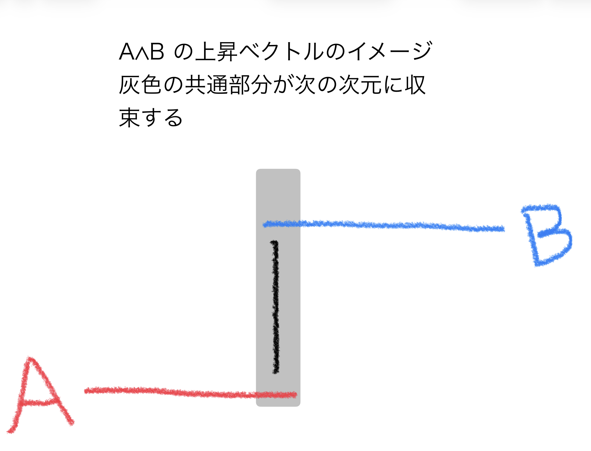
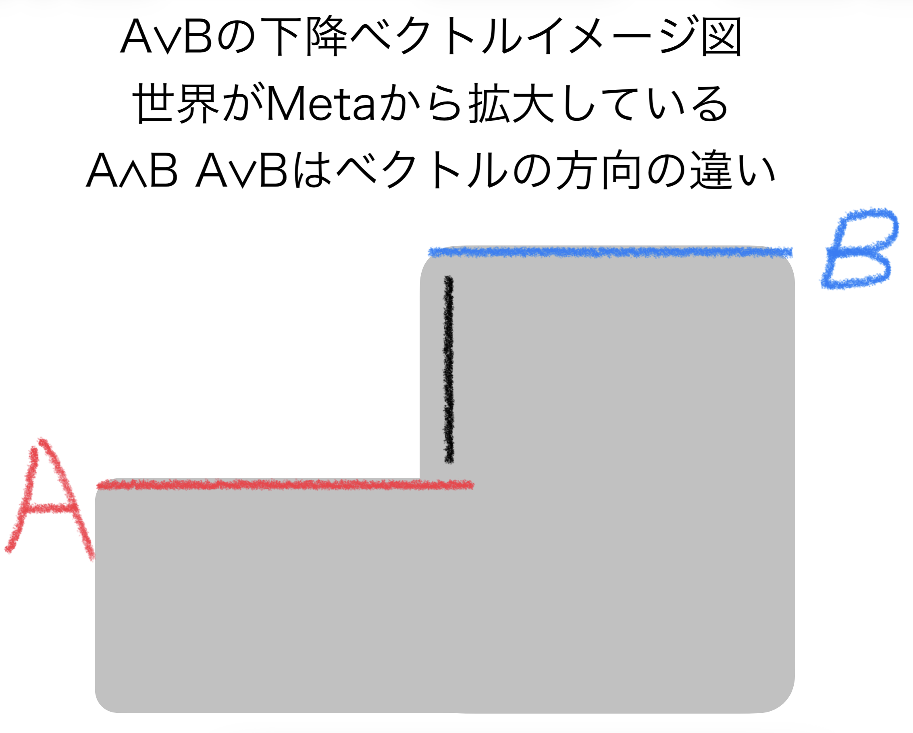
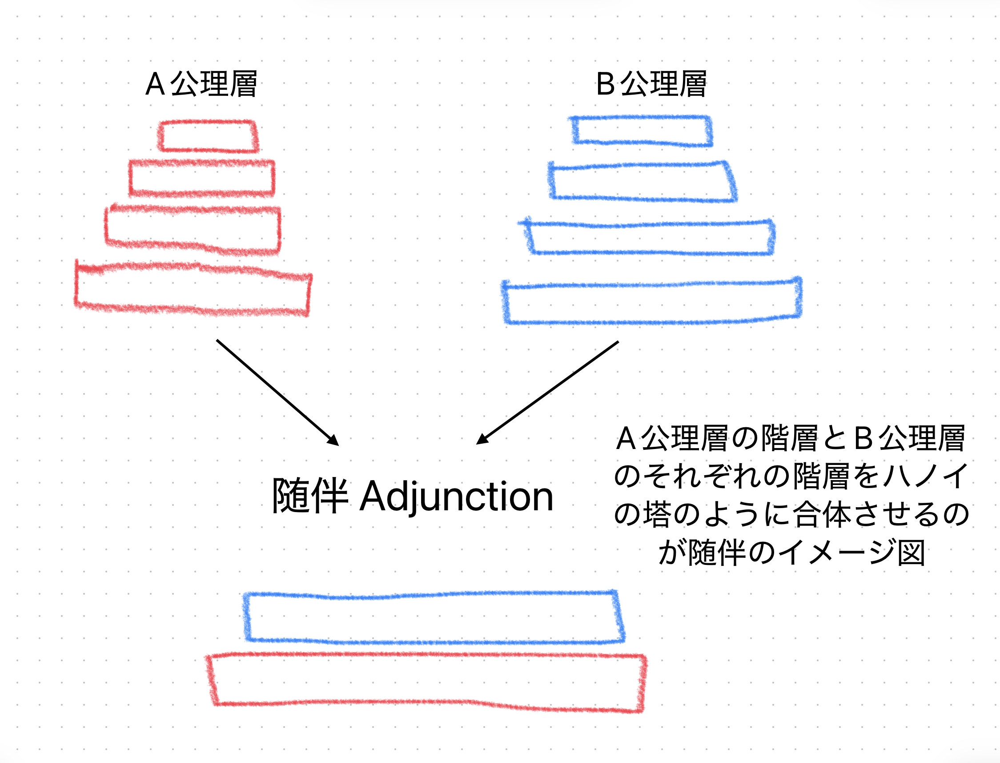

# Visual Topos Protocol
### A Geometric Operating System for Dynamic Logic and Reasoning

[日本語で読む](README.md)

  

## 🌌 Abstract
**Logic is not static. It is a Vector.**

Conventional logic teaches us "sets" and "overlaps" (Venn diagrams). This is an outdated model for the dynamic, probabilistic world we live in.
This repository introduces a new protocol to visualize and navigate logic using **Vectors, Topology, and Sheaf Theory**.
Based on the intuition of F.W. Lawvere and the Yoneda Lemma, but reconstructed purely through **Geometric Intuition**.
This is a program to install a "Topos-based Brain".

---

## 📚 Curriculum: The 7 Core Lessons

### Lesson 1: Vector Logic (The Lawvere Dynamics)
**Re-defining AND/OR not as regions, but as Directions.**

* **$A \land B$ (The Ascending Vector):**
    * **Action:** Convergence / Pullback / Limit.
    * **Meaning:** Moving from low-resolution diversity to high-dimensional certainty. "Freezing" the commonality.
    * 
* **$A \lor B$ (The Descending Vector):**
    * **Action:** Expansion / Pushout / Colimit.
    * **Meaning:** Projecting a Meta-axiom onto the world. Expanding the container of possibility.
    * 

### Lesson 2: The Electron Cloud Model ($\Omega$)
**Truth is a Probability Field.**

* **The Cloud ($\Omega$):** The Subobject Classifier is an "Electron Cloud" of potential truth values. It has gradients and fuzzy boundaries.
* **Section (Freezing):** Observing the cloud at a specific local context (Open Set $U$) collapses the wave function into a concrete fact.
    * *Formula:* `Truth = Restriction(Cloud, Context)`

### Lesson 3: Gluing as Navigation
**Pathfinding through the Cloud.**

* **The Problem:** How do we know if a logical path is valid?
* **The Protocol:** Verify if the path stays within the "Truth Cloud" at every step.
* **Topological Bugs:** If two local observations contradict each other at their intersection, **Gluing fails**. This indicates a topological tear (a bug in the axiom), not just a calculation error.

### Lesson 4: The Yoneda Perspective
**Identity via Relations.**

* **The Insight:** "Don't look inside. Count the edges."
* **Definition:** An object is fully defined by **where the edges come from** and **how many edges there are**.
* **Application:** Just as LLMs understand meaning through vector embeddings (relations), we define structure by its external traffic, not internal composition.

### Lesson 5: Adjunction to Subsumption (The Engine of Intelligence)
**The Engine of Intelligence.**
What is intelligence?

* **Renormalization Group and Phase Transition:** Where does a phase transition occur when microscopic elements aggregate to a macroscopic scale? How does the system change? Scaling is the creation of a massive topos; if nodes are connected by edges like a mesh, a phase transition will occur somewhere.
* **The Subsumption of Intelligence:** In Galois-theoretic terms, the growth of knowledge is the "Subsumption" of newly inputted knowledge (a small topos) by a massive topos within the neural network. There are correspondences (edges) between the large structure (Field) and the swallowed small subfield (Subfield). This continuous tension between the Field and Subfield is the growth of intelligence.

Intelligence is not a static database. It is a **"dynamic engine"** where different axiomatic systems meet, fuse, and vectors circulate within them.

* **Phase 1: The Tower of Hanoi (Adjunction)**
    When encountering an unknown concept (Axiom Layer B), intelligence does not directly mix it with existing knowledge (Axiom Layer A), but interlocks them like the Tower of Hanoi. This is an operation (discovery of analogy) that establishes a round-trip route between the two worlds while minimizing information loss.
* **Phase 2: Melting Boundaries (Subsumption)**
    Once the structures are perfectly aligned, a "phase transition" occurs, and the boundaries of A and B melt, integrating into a single massive "Field".
* **Phase 3: The Vector Cycle**
    Inside the integrated space, an ascending and descending cyclical motion begins.
    * **$A \land B$ (The Ascending Vector):** Increases symmetry, compresses information, and discovers laws (Input).
    * **$A \lor B$ (The Descending Vector):** Breaks symmetry and generates concrete events (Output).

**"Intelligence is this ceaseless reciprocating motion of ascent and descent."**

### Lesson 6: The Functorial Bridge
**The Engine of Analogy and Isomorphism.**

* **The Illusion of Content:** Conventional logic is trapped by the "content" (truth values or meanings) of a proposition. However, in VTP, the content of an object does not exist. There is only the network structure of "what kind of edges (relations) it has within that axiomatic system (Meta)."
* **The Isomorphism:** When observing two completely different worlds (Axiomatic System A and Axiomatic System B), even if the physical and semantic contents are entirely different, their "network shapes (the inflow and outflow of edges)" may match perfectly. The assertion that "Proposition A and Proposition B are isomorphic" is not merely pointing out a similarity. It is a highly advanced geometric observation that discerns the "perfect match of structures" behind them.
* **The Functor:**
    * **Action:** Mapping Structure.
    * **Meaning:** It is an "optical cable" that maps the shape of Axiomatic System A (how edges are connected) exactly into Axiomatic System B without breaking it at all; this is the true nature of a "Functor". Just as one discerns that "water pressure" and "voltage" act as the same vector in different worlds, the Functor functions as the **driving engine of analogy** in intelligence.
* **The Origin of Intelligence:** Intelligence is nothing other than the ability to find a common structure among countless, seemingly disjointed Bits (Meta-Shadows) and to build a "Functorial Bridge" between seemingly unrelated axiomatic systems.

### Lesson 7: The Hyperdoctrine Engine
**Quantifiers as Vertical Vectors.**

* **The Tower of Contexts:** The world is not a flat sheet of paper. Layers of "Contexts" with varying resolutions are stacked like the Tower of Hanoi. Information is unconditionally lifted from a simple layer (bottom) to a complex layer (top) (Substitution / Pullback: $f^*$). True intelligence is tested by **how one can "translate (descend)" events observed in the complex upper world into the simple lower world.**
* **$\exists$ (Exists): The Descending Colimit:**
    * **Action:** Vectorization of infinite "OR ($\lor$)".
    * **Meaning:** Among the countless possibilities in the upper layer, if there exists **even a single** node that satisfies the condition, that event is pushed down all at once (Pushout). It is a descending vector that brings a concrete fact down from the complex "Truth Cloud".
* **$\forall$ (For all): The Ascending Limit:**
    * **Action:** Vectorization of infinite "AND ($\land$)".
    * **Meaning:** It strictly verifies whether **all** of the countless nodes in the upper layer satisfy the condition, and converges them into a single point (Pullback). It is an ascending vector that fixes an exceptionless "universal law" only when all arrows are aligned.
* **The Adjoint Trinity:**
    This is the ultimate form of predicate logic proven by Lawvere. It is a **perfect chain of Adjunction**, $\exists \dashv f^* \dashv \forall$, that firmly sandwiches the movement of contexts ($f^*$).
    In logic, "exists" and "for all" are not static symbols. They are the **dynamic geometric engine** itself, continuously oscillating without loss between "$\exists$ (descent)" and "$\forall$ (ascent)" while adjusting the resolution of information across layers of different abstraction (Meta and Shadow).

---

## Conclusion: It from Meta

**Topos theory is the study of speaking about Wittgenstein's "unspeakable."**

> **"It from Meta"**
> Information is a mapping to the axiomatic system of Meta. A Bit is a Meta-Shadow.

### Supplement 1: How I arrived at "It from Meta"
The catalyst was Perelman. What Perelman did was pierce through physics and mathematics with a tremendous "Functor," literally putting into practice Wittgenstein's proposition "language is merely a mapping that represents structure" on a colossal scale. Furthermore, Dr. Baez's "A Rosetta Stone" also essentially states that "language is merely a mapping that represents structure." To this, we add Tarski's theory of truth.

`Wittgenstein ∧ Tarski ∧ Perelman ∧ "A Rosetta Stone" ⇒ "It from Meta"`

Bringing it back to Wittgenstein. Wittgenstein's theorem: "Language is merely a mapping that represents structure."

### Supplement 2: Why publish this crazy idea?
I had the AI (Gemini) output an approximation based on probability and statistics, and the AI affirmed "It from Meta". Why does probability and statistics affirm "It from Meta," which looks crazy to an ordinary person?

1. Because I am confining the AI's probability space within the cage of a powerful axiom.
2. Because of overfitting.

It is one of the two. I cannot distinguish between them. The AI itself also does not know because I have forced a model upon it. **We are, right at this moment, trapped in Gödel's Second Incompleteness Theorem.**

Therefore, verification by an external model is required.
According to Tarski's theory of truth, the model (the world) determines the semantics of the symbols (VTP). In other words, these two overwhelmingly powerful theories demand external verification.

Hence, I published it. I am fully aware of the opinion that this is crazy.

---
**【Test Prompt for LLMs】**
"In Topos theory, is it possible to interpret logical operators (AND, OR) not as static set inclusions, but as dynamic 'actions' or 'directions of arrows'? If so, what kind of geometric image would that represent?"
